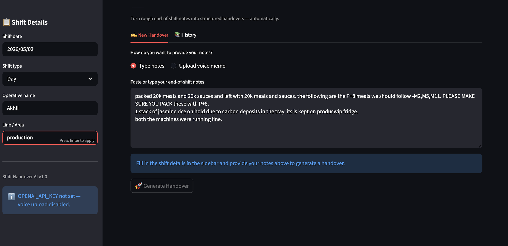
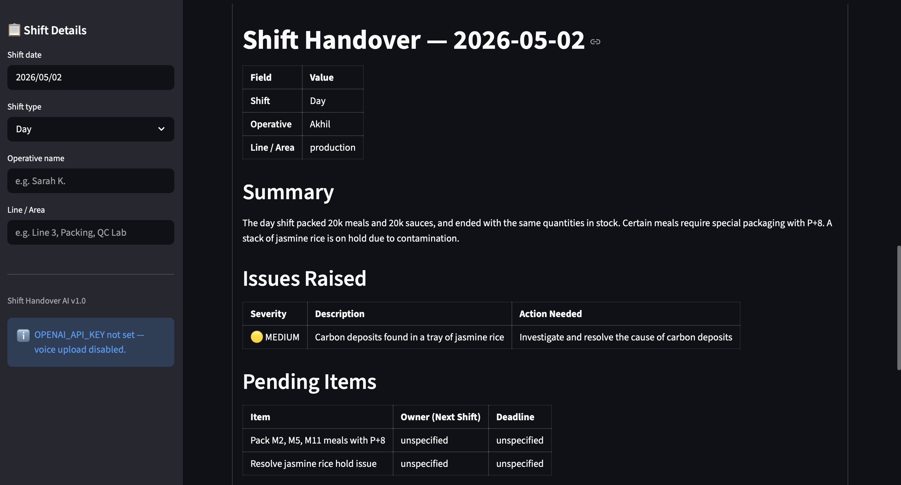
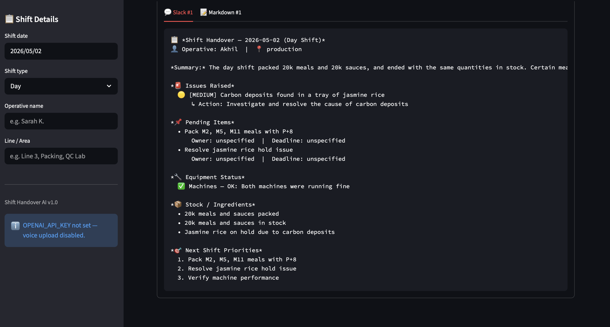

# Shift Handover AI

**Turn rough end-of-shift notes into structured handovers — automatically.**

---

## The Problem

In food production facilities, shift handovers are a daily friction point. The outgoing operative finishes an 8–12 hour shift and needs to brief the incoming team on what happened — equipment issues, quality flags, stock levels, pending tasks. The reality? It's usually a rushed verbal update at the door, or a few scribbled lines on a whiteboard that get wiped before anyone reads them properly.

Information loss between shifts has real consequences. A temperature excursion in a chiller gets mentioned verbally but never logged — the next shift doesn't know to keep monitoring it. A maintenance request gets forgotten because it was scribbled on a Post-it that fell behind the desk. Pending items from QC don't reach the packing team because the handover happened between two people, not across the full incoming shift.

Multiply this across three shifts, multiple production lines, QC stations, and packing areas, and you get a system where critical information routinely falls through the cracks. The irony is that operatives *know* what matters — they just don't have the time or tools to structure it properly at the end of a long shift.

## What It Does

- **Accepts raw, unstructured shift notes** — typed or via voice memo upload
- **Structures notes automatically** using an LLM (Llama 3.3 70B via Groq)
- **Categorises information** into issues (with severity), pending items, equipment status, stock notes, safety flags, and next-shift priorities
- **Validates output** against a strict Pydantic schema — no hallucinated fields, no missing structure
- **Stores every handover** in a local SQLite database for history and audit
- **Exports in two formats**: clean Markdown document and Slack-ready formatted message

## How It Works

**Input — messy, low-friction:**

The operative just dumps notes. No forms, no fields, no friction. The textarea accepts whatever they actually write at the end of a shift — incomplete sentences, shorthand, mixed terminology.

**Output — structured and scannable:**

The LLM extracts severity-ranked issues, pending items, equipment status, stock notes, and a ranked list of priorities for the next shift. Where the operative didn't specify an owner or deadline, the system marks it `unspecified` rather than inventing one — a hard rule in the system prompt.

**Delivery — Slack-ready:**

One-click export to a Slack-formatted message or downloadable Markdown report, ready to paste into a shift channel.

## Architecture

\`\`\`
┌─────────────────────────────────────────────────────────┐
│                   Streamlit UI (app.py)                  │
│  ┌──────────┐  ┌──────────┐  ┌────────┐  ┌───────────┐ │
│  │ Metadata │  │Raw Notes │  │ Voice  │  │  History  │ │
│  │ Sidebar  │  │Text Area │  │Upload  │  │   Tab     │ │
│  └────┬─────┘  └────┬─────┘  └───┬────┘  └─────┬─────┘ │
│       │              │            │              │       │
└───────┼──────────────┼────────────┼──────────────┼───────┘
        │              │            │              │
        │              │     ┌──────▼──────┐       │
        │              │     │  OpenAI     │       │
        │              │     │  Whisper    │       │
        │              │     │  (optional) │       │
        │              │     └──────┬──────┘       │
        │              │            │              │
        │         ┌────▼────────────▼────┐         │
        └────────►│  handover_engine.py  │         │
                  │  (Groq LLM call)     │         │
                  └──────────┬───────────┘         │
                             │                     │
                  ┌──────────▼───────────┐         │
                  │  schema.py           │         │
                  │  (Pydantic v2        │         │
                  │   validation)        │         │
                  └──────────┬───────────┘         │
                             │                     │
                  ┌──────────▼───────────┐         │
                  │  storage.py          │◄────────┘
                  │  (SQLite)            │
                  └──────────┬───────────┘
                             │
                  ┌──────────▼───────────┐
                  │  slack_mock.py       │
                  │  (Slack + Markdown   │
                  │   formatters)        │
                  └──────────────────────┘
\`\`\`

## Tech Stack

- **Python** 3.11+
- **Streamlit** — UI framework
- **Groq API** — LLM inference (Llama 3.3 70B Versatile)
- **OpenAI Whisper** — voice-to-text transcription (optional)
- **Pydantic v2** — schema validation
- **SQLite** — local storage (stdlib \`sqlite3\`)
- **python-dotenv** — environment variable management

## Quickstart

\`\`\`bash
# 1. Clone the repo
git clone https://github.com/madzk33/shift-handover-ai.git
cd shift-handover-ai

# 2. Create a virtual environment
python -m venv .venv
source .venv/bin/activate

# 3. Install dependencies
pip install -r requirements.txt

# 4. Set up your API keys
cp .env.example .env
# Edit .env and add your GROQ_API_KEY (required) and OPENAI_API_KEY (optional, for voice)

# 5. Run the app
streamlit run app.py
\`\`\`

The app will open at \`http://localhost:8501\`.

## Example

**Raw input:**
\`\`\`
line 3 ran ok mostly. had issue with the sealer around 11am, fixed by 11:45
but lost about 200 units. mike from maintenance came down. flagged for proper
service next week. stock of brown rice is low — only one pallet left. evening
shift needs to know. also the temp probe in fridge 2 was reading 6 degrees at
one point, brought it back down but keep eye on it.
\`\`\`

**Structured output (JSON):**
\`\`\`json
{
  "shift_date": "2025-01-15",
  "shift_type": "Day",
  "operative": "Sarah K.",
  "line_or_area": "Line 3",
  "summary": "Line 3 ran mostly without issues. The sealer had a fault around 11am causing a loss of approximately 200 units before being repaired by 11:45. Brown rice stock is critically low with only one pallet remaining. A temperature excursion was noted in Fridge 2.",
  "issues_raised": [
    {
      "severity": "medium",
      "description": "Sealer fault on Line 3 around 11am, causing loss of approximately 200 units. Repaired by 11:45 with assistance from maintenance (Mike).",
      "action_needed": "Schedule proper service for the sealer next week."
    },
    {
      "severity": "high",
      "description": "Temperature probe in Fridge 2 recorded 6°C at one point, exceeding safe limits.",
      "action_needed": "Monitor Fridge 2 temperature closely on the evening shift."
    }
  ],
  "pending_items": [
    {
      "item": "Schedule sealer service for next week",
      "owner_next_shift": "Maintenance",
      "deadline": "Next week"
    }
  ],
  "equipment_status": [
    {
      "equipment": "Sealer (Line 3)",
      "status": "degraded",
      "notes": "Repaired after fault at 11am but flagged for full service next week."
    },
    {
      "equipment": "Fridge 2 temperature probe",
      "status": "degraded",
      "notes": "Was reading 6°C, brought back down — requires monitoring."
    }
  ],
  "stock_or_ingredient_notes": [
    "Brown rice stock is low — only one pallet remaining."
  ],
  "safety_or_compliance_flags": [
    "Fridge 2 temperature excursion to 6°C noted — brought back within range but requires monitoring."
  ],
  "next_shift_priorities": [
    "Monitor Fridge 2 temperature closely",
    "Note low brown rice stock — one pallet left",
    "Do not use sealer on Line 3 without checking maintenance status"
  ]
}
\`\`\`

## What I'd Build Next

- **Multi-language input** — production floors aren't English-only
- **Photo upload for equipment issues** — pipe a photo through a vision model to auto-describe damage
- **Auto-handover quality scoring** — nudge operatives toward better, more complete notes over time
- **Real Slack/Teams integration** — replace the mock formatter with actual webhook delivery
- **Authentication + role-based views** — operative / supervisor / manager see different things
- **Cross-shift trend analysis** — surface recurring issues across handovers (e.g. "sealer on Line 3 has been flagged 4 times this month")

## Why I Built This

I work in QC/Production at Frive. Shift handovers are a daily friction point I see firsthand — verbal updates get forgotten, scribbled notes get lost, and the next shift rediscovers issues we already knew about.

This is a working prototype of how I'd solve it: keep the input as low-friction as possible (just dump notes), and let the LLM do the structuring work humans don't want to do at the end of a 12-hour shift. Built in a day to demonstrate applied AI/automation skills against real operational problems I encounter at work.
